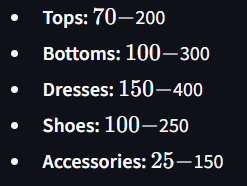

# Introduction: 
I wanted to learn how to build a prototype of something that leveraged generative AI as well as gave me some exposure on how to work with external data sources, including how to call APIs and leverage API data.

This was my first time working with this “stack” (Streamlit, Vertex AI/Gemini API, and Google Maps/Places). Reasons for choosing each of these components:
- Streamlit for its perceived ease of displaying prototypes as webapps using a pythonic approach
- Google Maps/Places due to my app’s functionality (the API also allows for $200 worth of API calls for free every month, which definitely doesn’t hurt)
- Vertex AI/Gemini API for the intro offer I got of $300 in free credits to use in my first three months.

# Features:
### Search for restaurants nearby based on user criteria/information:
| User Criteria | Type | Description |
| -------- | ------- | ------- |
| Location  | N/A or free text field | (1) the user’s own location, automatically collected with permission or (2) a user inputted address |
| Place | Free text field | What type of place they are looking for |
| Price Range | Radio button | Casual, mid-range, expensive, or catch-all |
| # of Recommendations | Slider | Number of recommendations to generate |
  
### View restaurant(s) information:
- Name
- Rating
- Number of ratings
   Distance
- Google Maps URI
- About (generative summary)
- Interactive maps widget with user and place location pins
  
### Chat about a specific restaurant by clicking “Learn More”:
- Can ask about information that is not displayed in the basic information above, such as hours open
- Can ask about more niche information, such as whether a place is good for kids/dogs
- Chat responses generated with Gemini 1.5 Flash
- Can switch chat context anytime by clicking on a different place's “Learn More”
  
# Future improvements:
- Incorporating function calling for enhanced accuracy
- Adding functionality for displaying locations along a route

# Known Issues:
- The chatbot occasionally has Markup hiccups that may be a result of Gemini generating LaTeX and Streamlit not picking up on it properly 
- There may occasionally be the following error, which seems to be documented as a bug from Gemini's own generation:
``Please let the response complete iteration before accessing the final accumulated attributes (or call `response.resolve()`)``

# Lessons Learned and Challenges:
Linked [here](https://docs.google.com/document/d/1trnOI8a_BXjLVzR5KyACOk1MHnrXKgk9a5vRRSIWOwE/edit?usp=sharing).

## V4 (current)
### Demo:
https://youtu.be/N1roeHgri00

### Added Features:
- Expanded place lookup and queries to all places (not just restaurants)

### Lessons Learned:
- Gemini's built-in search functionality makes it more flexible in handling edge cases, even when the user goes off the happy path (e.g. searching for other places when still in the funnel of chatting about a specific place). Of course, not guaranteed to consistently handle these edge cases and best to still build in guardrails.

## V3
### Demo:
https://youtu.be/5h8C1cZRIvg

### Added Features:
- Interactive maps widget
- Additional error handling for text generation

### Lessons Learned:
- For prototyping, best to use the Gemini API instead of the Vertex AI API (more cost efficient and less of a hassle working with interfaces like Streamlit)
- Folium is the most common maps widget used in conjunction with Streamlit

## V2

### Demo:
https://youtu.be/Rflkb8SAG3c

### Added Features:
- Geolocation
- Places (new) API functionality
  - text search
  - place details
- chatbot functionality with Gemini 1.5 Flash

### Lessons learned:
- Google Places (new) documentation of the Python client library is poor and has bugs, ended up using a combination of a Youtube tutorial's code + get requests
- Once you get more in the weeds with Streamlit, you run up against limitations in customizability (e.g. carousel, button behavior)
- If your Google Cloud Platform project has an OAuth consent screen configured for an external user type and a publishing status of "Testing" is issued a refresh token, it expires in 7 days and you will get a RefreshError 'invalid_grant: Token has been expired or revoked.' To mitigate this at least temporarily, delete the token_places_v1.json under /token_files to reauthenticate yourself for another week.
  - Reference: https://stackoverflow.com/questions/71994891/access-google-api-using-python-refresh-error-invalid-grant-appears-suddenly-a

## V1 

### Demo:
https://youtu.be/PpdN8AWONwA

### Added Features:
- Basic Streamlit front-end
- Gemini results generation

### Lessons learned:
- Streamlit generally easy to work with
- Google authentication does not have established best practices with Github Codespaces, and still involved some setup on local

